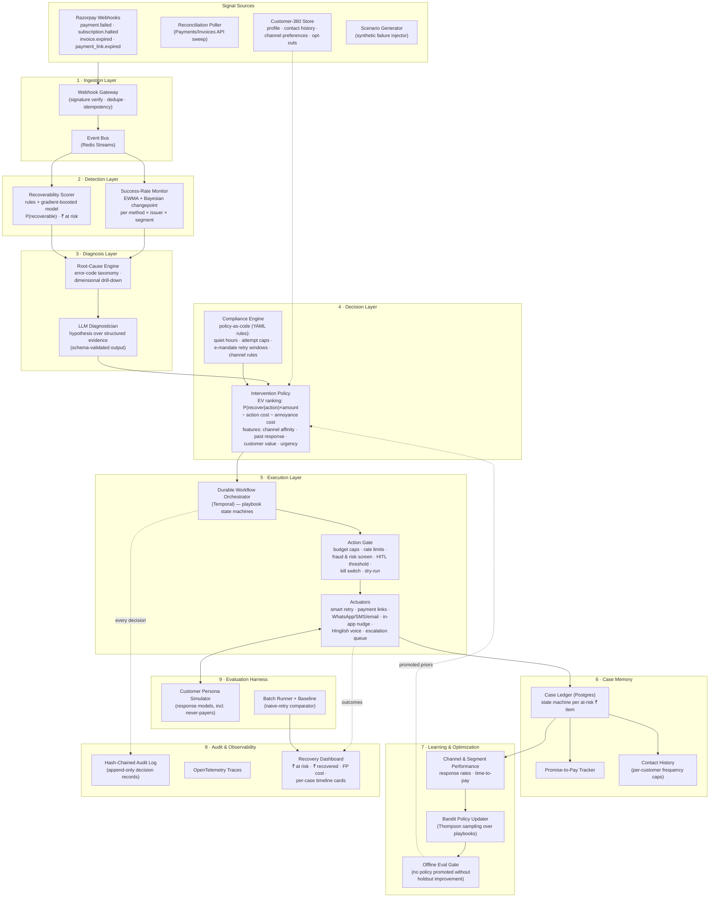
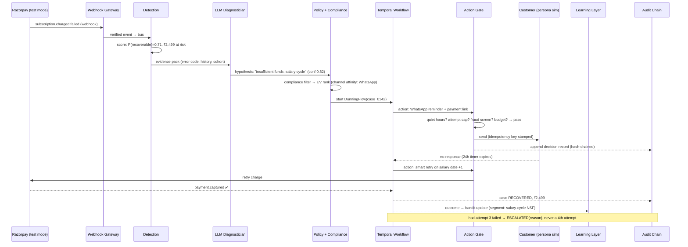

# RevRecover — AI Revenue Recovery Agent

**Razorpay AI Buildathon · Track 3: AI Revenue Recovery**

> Find revenue that's slipping away and win it back — with every money action
> explainable, bounded, and gated.

RevRecover is an autonomous, auditable agent system that closes the full
**detect → diagnose → decide → act → measure → learn** loop over three
revenue-loss surfaces: failed/degrading payments, failed subscription charges
(dunning), and overdue B2B receivables. It is built around one non-negotiable
principle: **LLMs reason and communicate; deterministic code moves money.**

*(v2 — merged design: adopts an explicit learning layer, a fraud/risk screen
in the action gate, an in-app channel, and a customer-360 signal source from
the reviewed reference diagram; retains the evaluation harness, durable
workflows, hash-chained audit, and hard LLM/money boundary from v1.)*

---

## 1. Design goals (mapped to the judging bar)

| Judging requirement | Architectural answer |
|---|---|
| Measured money recovered across a batch | Built-in evaluation harness: 500-case synthetic batch, holdout split, baseline comparison, ₹-recovered report |
| Compliant escalation | Policy-as-code compliance engine + human-in-the-loop (HITL) escalation queue with SLA states |
| Stopping rules | Declarative per-playbook stop conditions enforced by the orchestrator, not by the LLM |
| Audit trail | Append-only, hash-chained decision ledger capturing evidence, reasoning, action, and outcome for every case |
| Graceful failure handling | Saga-style compensation, idempotent actions, kill switch, dry-run mode |
| Improves over the batch | Learning layer: bandit policy updates + channel/segment performance feedback, gated by offline eval |

---

## 2. System overview



---

## 3. Layer-by-layer specification

### 3.1 Ingestion — Webhook Gateway + Event Bus + Customer-360

- **Webhook Gateway** (FastAPI): verifies `X-Razorpay-Signature` (HMAC-SHA256),
  deduplicates on `event.id`, persists the raw payload, then ACKs immediately
  (< 200 ms) — all processing is async downstream. Razorpay retries undelivered
  webhooks, so the gateway is idempotent by design.
- **Event Bus** (Redis Streams + consumer groups): decouples ingestion from
  processing; gives replay, back-pressure, and at-least-once delivery with
  consumer-side dedupe via event ID.
- **Reconciliation Poller**: hourly sweep of the Payments/Invoices APIs to
  catch missed webhooks (webhooks are a notification channel, not a source of
  truth — the poller is).
- **Customer-360 Store**: per-customer profile assembled from case history —
  channel preferences, past response rates by channel, opt-outs, tenure,
  lifetime value, open promises. Feeds the decision layer's channel-affinity
  and annoyance-cost features and the compliance engine's frequency caps.
  In the demo this is populated by the scenario generator.
- **Scenario Generator**: test mode won't organically produce failures at
  batch scale, so a seeded generator creates realistic cases: distribution of
  UPI/card/netbanking failures with real Razorpay error codes
  (`BAD_REQUEST_ERROR`, `GATEWAY_ERROR`, issuer-down patterns), varied
  amounts, customer segments, and time-of-day patterns. Seeded ⇒ reproducible
  by judges.

### 3.2 Detection — two complementary detectors

1. **Aggregate degradation** (the "payment degradation → root cause" direction):
   success-rate time series per `(method × issuer × merchant segment)` cell,
   monitored with EWMA control bands plus Bayesian online changepoint
   detection. Fires a `DegradationDetected` event with the affected cell and
   estimated ₹/hour at risk. Statistical, not LLM — cheap, fast, explainable.
2. **Per-event recoverability scoring**: every failure/overdue event gets
   `P(recoverable)` and expected value from a hybrid scorer — hard rules for
   known-dead cases (card permanently blocked ⇒ don't retry) + a
   gradient-boosted model over features (error code class, retry history,
   customer tenure, amount, method). Cases below a floor are **deliberately
   not pursued** — chasing unrecoverable money is the false-positive cost the
   dashboard reports.

Every detected case is materialized as a **case card** (ID, type, customer,
₹ at risk, confidence, detected-at) — the unit the dashboard, audit trail,
and pitch demo all speak in.

### 3.3 Diagnosis — grounded LLM reasoning

- **Root-Cause Engine** (deterministic): maps error codes to a taxonomy
  (customer-side / issuer-side / network-side / merchant-config), does
  dimensional drill-down on degradation events ("failures concentrated in
  UPI × HDFC × last 40 min"), and assembles an **evidence pack** (structured
  JSON: metrics, code distributions, affected cohort).
- **LLM Diagnostician** (Claude, structured output): receives *only* the
  evidence pack — never raw freeform logs — and returns a schema-validated
  hypothesis: `{cause, failure_class: soft|hard, recovery_odds, confidence,
  recommended_playbook, human_summary}`. The human summary goes verbatim into
  the audit record. If confidence is below threshold, the case routes to
  escalation instead of auto-action.

One diagnostician with domain-specific evidence packs (payments / checkout /
receivables) — deliberately **not** one LLM agent per domain: a router plus
one reasoning step is cheaper, easier to test, and has one schema to validate.

### 3.4 Decision — policy engine with compliance as a hard constraint

- **Intervention selection**: expected-value ranking over the playbook
  catalog — `EV(action) = P(recover | action, case) × amount − cost(action) −
  annoyance_cost(customer)`. Scoring features include recovery odds from
  diagnosis, **channel affinity and past response rate** (from Customer-360),
  customer value, urgency (age of case, mandate windows), and cost of action.
  `P(recover|action)` starts from priors (published dunning benchmarks) and
  is updated by the learning layer (§3.7).
- **Compliance Engine** (policy-as-code, YAML evaluated deterministically):
  compliance is a **filter applied before ranking**, not a preference weight —
  a non-compliant action can never appear as the top recommendation.
  Example rules:

```yaml
# policy/compliance.yaml
contact:
  quiet_hours: { start: "21:00", end: "09:00", tz: "Asia/Kolkata" }  # RBI collection norms
  max_attempts_per_case: 3
  max_contacts_per_customer_per_week: 4
  min_gap_between_contacts: 24h
  tone: no_threats, no_penalty_language, identify_sender, offer_opt_out
mandate_retry:                      # RBI e-mandate rules
  window: presentation_day_only
  max_representments: 3
  require_pre_debit_notification: 24h
payments:
  max_auto_retries: 2
  never_retry_codes: [CARD_BLOCKED, ACCOUNT_CLOSED, FRAUD_SUSPECTED]
autonomy:
  hitl_amount_threshold_inr: 50000   # above this, human approves the action
  daily_action_budget: 500
  kill_switch: env:RECOVERY_KILL_SWITCH
```

- Every ranked decision is emitted as a **recommendation card** (action,
  channel, score, one-line reason, alternatives considered) — rendered on the
  dashboard and written to the audit chain.

### 3.5 Execution — durable playbooks with hard stopping rules

- **Orchestrator**: Temporal workflows — one durable workflow per case.
  Survives crashes, gives exactly-once activity semantics, native timers for
  wait-states ("wait 24 h for payment-link click"), and full history for free.
  (Lightweight fallback: Postgres-backed state machine + BullMQ, same
  contracts.)
- **Playbooks** (state machines, one per direction):
  - `SmartRetrySequencer` — error-code-aware retry timing; e-mandate cases
    respect representment windows and pre-debit notification.
  - `CheckoutRecovery` — abandoned checkout → personalized Payment Link
    (Razorpay Payment Links API) via WhatsApp/SMS/email/**in-app nudge** with
    LLM-drafted, compliance-linted copy.
  - `DunningFlow` — failed subscription charge → notify → retry → offer
    alternate method → grace period → escalate before cancel.
  - `ReceivablesChaser` — overdue invoice → escalating cadence (polite → firm
    → statement of account → human escalation); parses replies with the LLM
    to extract **promises-to-pay**, which become tracked commitments with
    follow-up timers.
  - `HinglishVoiceRecovery` — outbound voice (Exotel/Twilio sandbox, or
    simulated transcript channel in the demo): Claude-driven code-switched
    Hindi-English dialogue, strict script boundaries, immediate opt-out
    honoring, full transcript to audit log.
- **Action Gate** — every side-effecting action passes one chokepoint that
  enforces: compliance re-check at execution time (rules may have changed
  since decision time), **fraud & risk screen** (cases flagged suspicious —
  e.g. `FRAUD_SUSPECTED`, abuse-pattern velocity — are never pursued; they
  route to a risk queue, since recovering money from a fraudster is a loss,
  not a win), budget/rate caps, idempotency key stamping, HITL approval for
  above-threshold amounts, `DRY_RUN` mode (logs the action it *would* take),
  and the global kill switch.
- **Stopping rules** (declared per playbook, enforced by the orchestrator):
  max attempts, max case age, EV-below-cost, customer opt-out, two
  consecutive channel failures ⇒ terminal state `ABANDONED(reason)` or
  `ESCALATED(reason)` — never a silent stall. **The LLM cannot extend a
  workflow past its stop conditions.**

### 3.6 Case memory

Every at-risk rupee item is a **Case** with an explicit lifecycle:

```
DETECTED → DIAGNOSED → PLANNED → INTERVENING ⇄ WAITING(response | P2P | retry-window)
   → RECOVERED | PARTIALLY_RECOVERED | ESCALATED | ABANDONED
```

Outcome taxonomy per intervention: `SUCCESS`, `PROMISE_TO_PAY` (extracted
date + amount, tracked with follow-up timers), `FOLLOW_UP_DUE` (no response
yet — next attempt scheduled, possibly on a different channel), `FAILED`
(log reason; escalate on high value, repeated failures, compliance blocks,
or hard failures).

Postgres schema (core tables): `cases`, `case_events` (append-only),
`interventions`, `promises_to_pay`, `contact_log` (feeds per-customer
frequency caps), `customer_360`, `audit_chain`.

### 3.7 Learning & Optimization — improve across the batch, safely

- **Bandit policy updater**: Thompson sampling over playbook variants —
  every intervention outcome updates `P(recover | action, segment)`, so the
  agent provably improves within the measured batch run.
- **Channel & segment performance**: response rate, time-to-pay, and
  opt-out rate per channel × customer segment, feeding channel-affinity
  features back to the decision layer and updating Customer-360.
- **Threshold tuning**: recoverability-score floor and escalation thresholds
  tuned on the holdout slice only — never on the measured batch.
- **Safety rails**: learned policies adjust *priors and rankings only* — they
  can never relax a compliance rule, raise an attempt cap, or bypass the
  Action Gate. A policy update is **promoted only if it beats the incumbent
  on the offline holdout** (the eval gate); otherwise it's logged and dropped.

### 3.8 Audit trail — tamper-evident by construction

Each decision record is appended with
`hash_n = SHA256(hash_{n-1} ‖ record_n)` — a hash chain, so post-hoc editing
of history is detectable. A record captures the full "why":

```json
{
  "case_id": "case_0142",
  "ts": "2026-08-31T14:02:11+05:30",
  "stage": "DECIDE",
  "evidence_ref": "ev_0142_03",
  "hypothesis": "Issuer-side UPI timeout (HDFC), transient",
  "considered": [
    {"action": "retry_now", "ev_inr": -12, "rejected": "inside issuer outage window"},
    {"action": "retry_in_2h", "ev_inr": 431, "chosen": true},
    {"action": "whatsapp_nudge", "ev_inr": 210, "rejected": "lower EV; contact budget preserved"}
  ],
  "compliance_checks": {"quiet_hours": "pass", "attempt_cap": "pass (1/3)"},
  "actor": "agent",
  "prev_hash": "9f3ab…",
  "hash": "c07d1…"
}
```

The trail covers the full chain per case: event received → AI reasoning &
scores → selected intervention (with rejected alternatives) → compliance
decision → action executed → customer response → outcome → ₹ recovered or
not. The dashboard renders it as a per-case timeline of cards — detected-case
card, root-cause & odds card, recommendation card, outcome card — the
artifact a judge (or a compliance officer) reads, and the storyboard for the
pitch video.

### 3.9 Evaluation harness — how "measured money recovered" is proven

- **Customer Persona Simulator**: responds to interventions with calibrated
  probabilities — cooperative payers, needs-reminder, disputers, promise-
  breakers, and **never-payers** (so 100% recovery is impossible and the
  metric is honest). Response priors are grounded in published dunning /
  cart-recovery benchmarks and documented in `eval/PRIORS.md`. The simulator
  is **seeded and frozen before the batch run** — the agent cannot overfit
  to it, and judges can re-run it byte-for-byte.
- **Batch protocol**: 500 generated cases → 100 held out for threshold
  tuning, 400 for the measured run. The agent runs unattended; the report is
  produced by the harness, not hand-assembled.
- **Baselines**: (a) do-nothing, (b) naive retry-everything-3× — so the
  headline number is *incremental* recovery, not gross.
- **Reported metrics**: ₹ at risk, ₹ recovered (absolute + % + vs baselines),
  recovery by playbook, **false-positive cost** (spend on unrecoverable cases
  + contacts to would-have-paid-anyway customers, measured via a no-contact
  holdout slice), escalation rate and precision, stopping-rule trigger
  counts, mean actions per recovered rupee, P50/P95 time-to-recovery, and
  **learning curve** (recovery rate over batch quartiles — showing the bandit
  improving).

---

## 4. End-to-end sequence (dunning example)



---

## 5. Where the LLM is — and is not

| LLM does | LLM never does |
|---|---|
| Diagnosis narratives over structured evidence | Execute a retry / move money |
| Drafting customer messages (then compliance-linted by a second LLM pass + rule check) | Decide whether an action passes compliance |
| Hinglish voice/chat conversation within script bounds | Extend attempts past stopping rules |
| Extracting promises-to-pay from replies | Write to the ledger or audit chain directly |
| Human-readable audit summaries | Choose to skip the Action Gate |
| — | Relax a compliance rule via "learning" |

All LLM calls use structured outputs with JSON-schema validation and a
deterministic fallback (schema failure ⇒ escalate, never guess). Prompt +
response are stored with the audit record for replayability.

---

## 6. Failure handling & security

- **Idempotency everywhere**: every actuator call carries an idempotency key
  derived from `(case_id, step_id)`; webhook replay is harmless.
- **Saga compensation**: partial multi-step interventions roll back cleanly
  (e.g., cancel an issued payment link if the case is closed by direct payment).
- **Graceful degradation**: LLM down ⇒ playbooks continue with rule-based
  templates; Razorpay API 5xx ⇒ exponential backoff with jitter, circuit
  breaker per endpoint.
- **Demonstrated failure** (buildathon requirement): the demo script includes
  a poisoned case — issuer outage mid-retry — showing detection, backoff,
  re-diagnosis, and compliant re-planning on camera.
- **Security**: webhook HMAC verification, API keys in env/secret store (never
  in repo), PII minimization in LLM prompts (tokenized customer refs),
  audit log contains references — not raw PII.

---

## 7. Tech stack

Deliberately scoped for a solo build that judges can reproduce with one
command — **not** an enterprise BOM (no Kafka, no Kubernetes, no separate
feature store or warehouse; Postgres and Redis cover those roles at this
scale).

| Concern | Choice | Why |
|---|---|---|
| Services | Python 3.12 + FastAPI | Speed of build, typing, async webhooks |
| Workflows | Temporal (Docker) | Durable timers, exactly-once activities, free history |
| Store | Postgres 16 | Ledger, audit chain, customer-360, analytics |
| Bus | Redis Streams | Lightweight, replayable, consumer groups |
| ML | LightGBM + `ruptures`/EWMA | Recoverability scoring, changepoint detection |
| LLM | Claude (Sonnet for dialogue, Haiku for linting) | Structured outputs, Hinglish quality |
| Comms | WhatsApp/SMS/email/in-app adapters (sandbox) + simulated channel | Demo-safe |
| Voice | Exotel/Twilio sandbox or transcript simulator | Hinglish recovery direction |
| Dashboard | Next.js + Recharts | Case timeline cards, batch report, learning curve |
| Infra | Docker Compose, single `make demo` | Judge reproducibility |

## 8. Repo layout

```
revrecover/
├── services/
│   ├── gateway/          # webhook ingest, signature verify, poller
│   ├── detection/        # changepoint monitor, recoverability scorer
│   ├── diagnosis/        # root-cause engine, LLM diagnostician
│   ├── policy/           # EV ranking, compliance engine
│   ├── workflows/        # Temporal playbooks + Action Gate
│   ├── actuators/        # razorpay client, comms, voice, in-app adapters
│   └── learning/         # bandit updater, performance tracker, eval gate
├── policy/               # compliance.yaml, playbook stop-rules
├── eval/                 # scenario generator, persona sim, batch runner, PRIORS.md
├── dashboard/            # case explorer + batch report UI
├── audit/                # hash-chain writer/verifier (`audit verify` CLI)
├── infra/                # docker-compose, temporal, postgres, redis
└── docs/                 # this file, demo script, pitch outline
```

## 9. Build sequence (2-week plan)

1. **Days 1–2**: scaffold, Razorpay test-mode client, webhook gateway, case ledger.
2. **Days 3–4**: scenario generator + persona simulator (the eval harness *first* — everything else is measured against it).
3. **Days 5–6**: detection (scorer + changepoint) and root-cause engine.
4. **Days 7–9**: Temporal playbooks — DunningFlow end-to-end first (fully closed loop), then ReceivablesChaser.
5. **Days 10–11**: compliance engine, Action Gate (incl. fraud screen), audit chain, LLM diagnosis + message drafting.
6. **Day 12**: learning layer (bandit + performance feedback), batch run, baselines, dashboard report with learning curve.
7. **Days 13–14**: Hinglish voice (stretch), failure demo, pitch video.

Ship order is deliberate: **one loop fully closed beats three half-loops** —
DunningFlow alone already satisfies the judging bar end-to-end.
