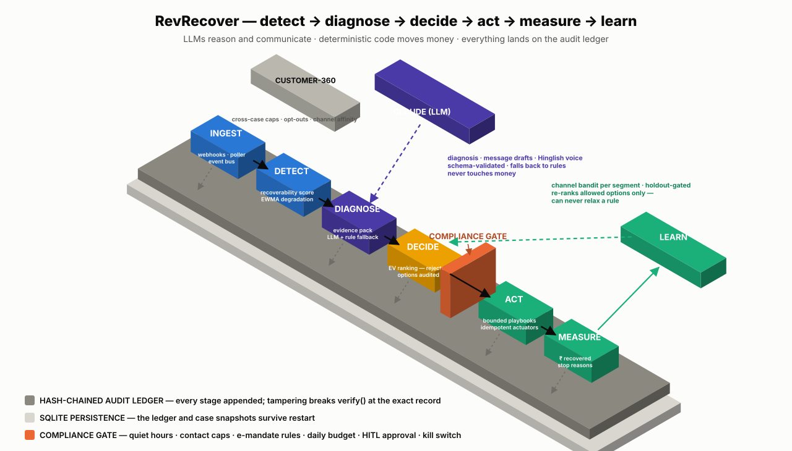

# RevRecover — AI Revenue Recovery Agent

[](https://github.com/ankit25bcs10610/razorpay-revenue-/actions/workflows/ci.yml)

**Razorpay AI Buildathon · Track 3: AI Revenue Recovery**

An autonomous, auditable agent that detects revenue slipping away — failed
payments, halted subscriptions, overdue invoices, abandoned checkouts —
diagnoses the cause, selects the highest-expected-value intervention, and
recovers the money inside hard compliance bounds. Every money action is
explainable, bounded, and gated; every claim in this README is reproducible
with a single `make` command.

> **Design principle:** LLMs reason and communicate. Deterministic code
> moves money. The model can make a message warmer or a diagnosis sharper;
> it can never extend an attempt, relax a rule, or skip the action gate.

---

## Contents

1. [Measured results](#1-measured-results)
2. [Quick start](#2-quick-start)
3. [How it maps to the judging bar](#3-how-it-maps-to-the-judging-bar)
4. [Architecture](#4-architecture)
5. [Life of a case](#5-life-of-a-case)
6. [The LLM boundary](#6-the-llm-boundary)
7. [Compliance and safety](#7-compliance-and-safety)
8. [Evaluation methodology](#8-evaluation-methodology)
9. [The audit trail](#9-the-audit-trail)
10. [Webhook gateway](#10-webhook-gateway)
11. [Project structure](#11-project-structure)
12. [Engineering practices](#12-engineering-practices)
13. [Configuration](#13-configuration)
14. [Roadmap](#14-roadmap)

---

## 1. Measured results

`make demo` runs a seeded 400-case batch end to end and prints:

```
RevRecover — measured batch run (seed=2026, n=400)
========================================================
  Pursue floor 0.2 — tuned on a 100-case holdout (net ₹204,550), never on this batch
  Revenue at risk          ₹   1,859,405
  Recovered (static)       ₹     782,040  (42.1%)
  Recovered (learning)     ₹     907,129  (48.8%)
  Baseline: do nothing     ₹     137,659
  Baseline: naive retry    ₹     684,502
  Incremental (learning)   ₹     769,470
--------------------------------------------------------
  Learning curve (quartile recovery): 42.8% → 52.2% → 54.2% → 49.0%
  Cases: 198 recovered / 8 escalated / 194 abandoned
  Contacts sent: 534 (false-positive/annoyance: 29)
  Audit chain: 2547 records, intact=True
--------------------------------------------------------
  Recovered by playbook: checkout_recovery ₹113,715, dunning ₹353,013,
    receivables ₹178,567, smart_retry ₹219,686, update_method ₹42,148
  Stop reasons: attempts exhausted ×120, customer opted out ×17,
    high value unresolved ×8, not recoverable ×57, payment captured ×198
  Actions per recovery: 1.59 · time-to-recovery P50 1.0d / P95 2.0d
```

**How to read this report:**

| Line | What it means |
|---|---|
| *Pursue floor tuned on holdout* | The only tunable threshold is chosen on a separate 100-case slice generated from a derived seed. The measured batch never tunes itself. |
| *Recovered (learning) vs (static)* | Same seed, same cases. The Thompson-sampling bandit adds ₹1.25L purely by learning which contact channel works per customer segment. |
| *Baselines* | "Do nothing" counts customers who would have paid anyway; "naive retry" retries everything three times. The agent's value is the increment above these, not the gross figure. |
| *Learning curve* | Recovery rate per batch quartile — the bandit visibly improving inside a single run. |
| *Annoyance contacts* | Nudges sent to customers who would have paid without contact. False-positive cost is reported, never hidden. |
| *Stop reasons* | All 400 cases end in an explicit terminal state with a reason. No silent stalls. |

The recovery rate *decreased* over the project's life as the simulator and
compliance grew stricter (customer channel preferences, RBI e-mandate
pre-debit notices, expected-value gates). We kept the honest number:
compliance costs measurable money, and the result stands anyway.

## 2. Quick start

Requires Python ≥ 3.12 and [uv](https://docs.astral.sh/uv/). No API keys,
no network, no external services — everything below is deterministic.

```bash
git clone https://github.com/ankit25bcs10610/razorpay-revenue-.git
cd razorpay-revenue-
uv sync
```

| Command | What it does |
|---|---|
| `make test` | Full test suite — 247 tests incl. property-based invariants, ~2 seconds |
| `make demo` | The measured 400-case batch report above |
| `make sweep` | Robustness sweep: static vs learning across 5 seeds × 400 cases |
| `make failure-demo` | An issuer outage mid-retry, handled and recovered, printed from the audit chain |
| `make dashboard` | Generates `dashboard.html` — KPI tiles, learning curve, ROI estimate, every case's audit timeline |
| `make live-demo` | **One real rupee-cycle on real rails**: creates an actual test-mode Payment Link, you pay it with a test card, the agent detects the capture and closes the case (needs `RAZORPAY_KEY_ID`/`RAZORPAY_KEY_SECRET` test keys; refuses live keys) |
| `make voice-demo` | A bounded Hinglish recovery call, printed as a transcript |
| `make demo-llm` | Six cases with live Claude diagnosis, reasoning printed from the audit chain (needs `ANTHROPIC_API_KEY`) |
| `make serve` | Full gateway on `:8000`: webhooks in, `POST /admin/process` drives the worker, `GET /dashboard` is a live auto-refreshing case view |

Interrogate any persisted audit ledger from the command line:

```bash
uv run python -m revrecover.audit verify <audit.db>        # exit 0 intact / 1 + broken record
uv run python -m revrecover.audit ask <audit.db> "why did case_pay_X get abandoned?"
```

**Ask the Ledger** answers in natural language strictly from the named
case's records, citing record numbers; hallucinated citations or an API
failure degrade to a deterministic timeline summary. The audit trail is
not just tamper-evident — it's interrogatable.

Containerized gateway: `docker compose -f infra/docker-compose.yml up gateway`.

To enable live Claude diagnosis and message drafting, set `ANTHROPIC_API_KEY`
and inject `Diagnostician(AnthropicDiagnosisClient())` / `MessageDrafter(...)`.
Every LLM integration degrades to deterministic rules on any failure, so the
system runs identically with or without a key.

## 3. How it maps to the judging bar

The track's bar: *"Measured money recovered across a batch, with compliant
escalation, stopping rules, and an audit trail."*

| Requirement | Implementation | Proof |
|---|---|---|
| Measured money recovered across a batch | Seeded 400-case batch, frozen persona simulator, do-nothing and naive-retry baselines, holdout-tuned thresholds | `make demo`, `tests/test_batch*.py` |
| Stopping rules | Finite playbooks, attempt caps, negative-EV abandonment, daily action budget, opt-outs honored instantly and permanently, kill switch | `test_never_payer_stops_after_max_attempts_never_a_fourth`, `test_flow_abandons_negative_ev_cases_before_spending_money` |
| Compliant escalation | Policy-as-code: quiet hours (IST), cross-case contact caps, RBI e-mandate rules, HITL approval above ₹50k; escalation to a human is always allowed | `tests/test_compliance*.py` |
| Audit trail | Append-only hash-chained ledger (in-memory and SQLite); every stage recorded including **considered-and-rejected alternatives with their expected values** | `test_verify_detects_tampered_payload`, `make dashboard` |
| Graceful failure handling | Actuator failures audited, backed off, re-planned; retry/backoff + circuit breaker on the API client | `make failure-demo`, `tests/test_flow_failure.py` |
| Honest metrics | False-positive cost, per-playbook breakdown, stop-reason accounting, P50/P95 time-to-recovery, learning curve | the report itself |

## 4. Architecture

<p align="center">
  
</p>

Full design document: [ARCHITECTURE.md](ARCHITECTURE.md). The diagram is
generated code, not a drawing — regenerate it with
`uv run python scripts/generate_architecture_svg.py`. How to read it:

- **The gray platform** is the hash-chained audit ledger: every stage of
  every case appends to it, and it rests on SQLite persistence.
- **The six slabs** are the loop: detect → diagnose → decide → act →
  measure → learn.
- **The orange wall** is the compliance gate — the only path from a
  decision to an action runs through it.
- **The floating planes** are constrained helpers: the LLM (reasons and
  drafts, schema-validated, falls back to rules, never touches money) and
  the learning bandit (re-ranks allowed options, can never relax a rule).

| Layer | Module | Responsibility |
|---|---|---|
| Ingestion | `gateway/` | FastAPI webhook gateway (HMAC verification, dedupe), reconciliation poller (the API is the source of truth; webhooks are notifications), event bus with consumer-group semantics, and `RecoveryService` — the wired webhook → bus → worker pipeline sharing one SQLite audit chain, Customer-360, and daily budget |
| Detection | `detection/` | Per-event recoverability scoring (hard failures are never pursued) and a dual-EWMA degradation monitor per method × issuer cell whose alerts mark an OutageRegistry — the flow defers retries into a down issuer and resumes when the mark expires |
| Diagnosis | `diagnosis/` | Claude structured-output diagnosis over a PII-free evidence pack; deterministic rule fallback on any failure |
| Decision | `policy/` | Expected-value ranking of interventions, hard-filtered by policy-as-code compliance |
| Execution | `workflows/` | Bounded playbooks behind a single action gate; blocked steps defer, failures back off, dry-run supported |
| Learning | `learning/` | Per-segment channel bandit — re-ranks allowed options only, structurally unable to relax a rule |
| Communication | `comms/` | LLM-drafted messages gated by deterministic lint; bounded Hinglish voice agent |
| Actuators | `actuators/` | Razorpay test-mode client: Payment Links with idempotent reference IDs, backoff, circuit breaker |
| Memory | `domain/`, `memory/` | Case lifecycle state machine; Customer-360 (cross-case caps, permanent opt-outs, channel affinity) |
| Audit & storage | `audit/`, `storage/` | Tamper-evident hash chain; SQLite persistence surviving restart |
| Evaluation | `evaluation/` | Scenario generator, persona simulator, holdout tuning, batch runner, failure demo |
| Dashboard | `dashboard/` | Zero-dependency single-file HTML report |

## 5. Life of a case

1. **Detect** — a `payment.failed` webhook (or poller sweep) becomes a
   `Case`. The scorer assigns `P(recoverable)`; hard failures (blocked
   card, fraud) are abandoned without ever touching the customer.
2. **Diagnose** — a structured, PII-free evidence pack goes to the LLM
   diagnostician; its answer is schema-validated against a closed playbook
   set. Any failure — malformed JSON, hallucinated playbook, low
   confidence, API outage — falls back to the rule engine.
3. **Plan** — interventions are ranked by expected value
   (`P(recover) × amount − action costs − annoyance`). The audit records
   every alternative considered and why it was rejected. A case whose
   best option loses money is abandoned before a rupee is spent.
4. **Act** — the playbook executes step by step through the action gate:
   compliance re-checked at execution time, budget counted, idempotency
   keys stamped. Blocked steps defer 24 hours; transient actuator
   failures are audited and retried; opt-outs end everything immediately.
5. **Measure** — the outcome (recovered / escalated / abandoned, always
   with a reason) closes the case and the batch report aggregates it.
6. **Learn** — the bandit updates `P(success | channel, segment)` from the
   outcome. Learning adjusts rankings only; it can never touch a rule.

## 6. The LLM boundary

| The LLM does | The LLM can never do |
|---|---|
| Diagnose root causes over structured evidence | Execute a retry or move money |
| Recommend a playbook (validated against a closed set) | Pass or relax a compliance check |
| Draft customer messages (gated by deterministic lint) | Extend attempts past stopping rules |
| Converse in Hinglish on voice calls (hard turn cap) | See customer identifiers — evidence packs are PII-free, by test |
| Write the human-readable audit summaries | Skip the action gate or write to the ledger |

Every LLM call uses structured outputs with schema validation. Every
integration point has an adversarial test — a hallucinated playbook name, a
threatening message draft, a runaway voice model — and each one degrades to
deterministic behavior, recorded in the audit as `source: "fallback"`.

## 7. Compliance and safety

Declared in [`policy/compliance.yaml`](policy/compliance.yaml), enforced
deterministically before ranking and again at execution time:

- **Quiet hours** 21:00–09:00 IST (RBI collection-conduct norms)
- **Contact caps** — max 3 attempts per case, 4 contacts per customer per
  week (across cases, via Customer-360), 24h minimum gap
- **E-mandate rules** — subscription retries require a ≥24h pre-debit
  notification and respect a representment cap
- **Never-retry codes** — blocked cards, closed accounts, suspected fraud
- **Autonomy limits** — daily action budget, human approval above ₹50,000,
  dry-run mode, global kill switch
- **Opt-outs** — honored mid-conversation, stored permanently, checked
  before any new case touches the customer
- **Message lint** — no threat language, mandatory opt-out line and sender
  identity, length cap; applies to LLM and template output alike

Escalating to a human is always compliant — the escape hatch can never be
blocked.

## 8. Evaluation methodology

Razorpay test mode does not organically produce failures at batch scale, so
the harness is built first and frozen:

- **Scenario generator** — seeded distribution of case types, real error
  codes, amounts with a long tail crossing the HITL threshold, customer
  segments with correlated channel preferences.
- **Persona simulator** — seven deterministic customer personas including
  never-payers (100% recovery is impossible by construction) and self-cure
  customers (contacting them is counted as annoyance cost). Nudge-sensitive
  personas respond only on their preferred channel — the thing the learning
  layer has to discover.
- **Baselines** — do-nothing and naive-retry, so the headline is
  incremental.
- **Holdout protocol** — thresholds are tuned on a 100-case slice from a
  derived seed; the measured batch is never used for tuning.
- **Reproducibility** — same seed, byte-identical report, on any machine.
- **Robustness sweep** — `make sweep` re-runs both batches across five
  seeds. The learning lift holds on *every* seed, not a lucky one:
  static mean 47.4% (42.6–52.7%) vs learning mean 50.8% (46.0–56.2%).
- **Documented priors** — every simulator number is grounded and stated
  in [docs/PRIORS.md](docs/PRIORS.md); the live test-mode loop
  (`make live-demo`) shows the same machinery on real Razorpay rails.

## 9. The audit trail

Each record is hash-chained (`hash_n = SHA256(prev_hash ‖ body_n)`), so
editing or deleting any historical record breaks verification at that exact
position — in memory and in SQLite. A case's chain reads:

```
DETECT      error_code, amount, p_recover, playbook, pursue
DIAGNOSE    cause, odds, confidence, source (llm | fallback)
PLAN        every playbook considered, its EV, why rejected
DECIDE      action, channel, compliance checks passed/failed, HITL flag
ACT         response — or ACT_FAILED with the error, then backoff
OUTCOME     terminal state, reason, ₹ recovered, attempts, contacts
```

`make dashboard` renders this as per-case timeline cards; `make failure-demo`
prints one live, including a mid-retry issuer outage.

## 10. Webhook gateway

```bash
make serve   # RAZORPAY_WEBHOOK_SECRET defaults to whsec_demo
```

```bash
BODY='{"event":"payment.failed","payload":{"payment":{"entity":{"id":"pay_DEMO1","amount":249900,"customer_id":"cust_1","error_reason":"insufficient_funds"}}}}'
SIG=$(printf '%s' "$BODY" | openssl dgst -sha256 -hmac whsec_demo | awk '{print $2}')
curl -s -X POST http://127.0.0.1:8000/webhooks/razorpay \
  -H "content-type: application/json" \
  -H "x-razorpay-signature: $SIG" \
  -H "x-razorpay-event-id: evt_demo_1" \
  -d "$BODY"
```

The contract in three calls: valid signature → `{"status":"accepted"}`;
replayed event or payment already seen via the poller → `{"status":"duplicate"}`;
tampered body → `401`. Signature verification is constant-time HMAC-SHA256.

## 11. Project structure

```
├── src/revrecover/
│   ├── gateway/        # webhook app, signature, events, poller, bus
│   ├── detection/      # recoverability scorer, degradation monitor
│   ├── diagnosis/      # evidence packs, LLM diagnostician, Claude adapter
│   ├── policy/         # compliance engine, EV ranking, action budget
│   ├── workflows/      # the bounded recovery flow (playbooks + gate)
│   ├── learning/       # Thompson-sampling channel bandit
│   ├── comms/          # message drafter + lint, Hinglish voice agent
│   ├── actuators/      # resilient Razorpay REST client
│   ├── memory/         # Customer-360 store
│   ├── domain/         # case lifecycle state machine
│   ├── audit/          # hash-chained ledger
│   ├── storage/        # SQLite persistence (audit + cases)
│   ├── evaluation/     # harness, batch runner, tuning, failure demo
│   └── dashboard/      # single-file HTML report generator
├── policy/compliance.yaml
├── infra/              # Dockerfile, docker-compose
├── docs/DEMO.md        # timed 5-minute pitch script
├── tests/              # 247 tests, one file per module
└── ARCHITECTURE.md     # full design document
```

## 12. Engineering practices

- **Strict test-driven development** — every module's tests were written
  and watched fail before its implementation existed. 247 tests run in
  about two seconds with no network and no API keys, gated in CI on every
  push (lint + tests + both demos reproduced).
- **Property-based invariants** (Hypothesis) — laws, not examples: any
  append history verifies and any tamper is caught; the state machine
  keeps a connected history and terminal states absorb; compliance hard
  limits hold for arbitrary inputs; voice calls stay bounded for
  arbitrary customer utterances.
- **Adversarial testing at every trust boundary** — tampered audit records,
  hallucinated LLM output, threatening drafts, runaway dialogue, replayed
  webhooks, forged signatures, exhausted budgets, and races on shared
  stores (dedupe ledger and budget are lock-guarded; the SQLite chain is
  safe under FastAPI's threadpool — a defect the end-to-end test caught).
- **Injectable side effects** — clocks, sleepers, RNG, transports, and LLM
  clients are all injected, which is why the suite is fast and the
  production swaps (Temporal, Redis, Postgres, telephony) are interface
  changes, not rewrites.
- **Honest reporting** — when stricter compliance lowered the headline
  recovery rate, the number stayed and the reason is documented.

## 13. Configuration

| Variable | Default | Purpose |
|---|---|---|
| `RAZORPAY_WEBHOOK_SECRET` | `whsec_demo` | Webhook HMAC verification secret |
| `GATEWAY_HOST` | `127.0.0.1` | Gateway bind address (`0.0.0.0` in Docker) |
| `ANTHROPIC_API_KEY` | unset | Enables live LLM diagnosis/drafting; optional |

Business rules live in `policy/compliance.yaml` — one reviewable file for
quiet hours, caps, e-mandate rules, budgets, and the HITL threshold.

## 14. Roadmap

The remaining work consists of backend swaps behind interfaces that already
exist and are tested: **Temporal** for the flow loop (its semantics are
clock-injected and transfer unchanged), **Redis Streams** behind
`InMemoryBus`, **Postgres** behind the SQLite stores, a **telephony
adapter** behind the voice agent's responder, and **OpenTelemetry** spans
over the audit stages.

---

*Built for the Razorpay AI Buildathon, Track 3 (AI Revenue Recovery).
The 5-minute pitch script is in [docs/DEMO.md](docs/DEMO.md).*
